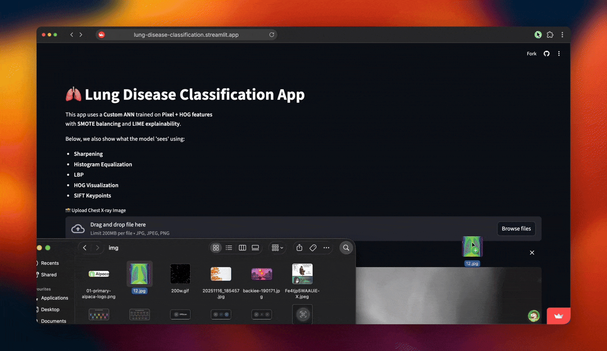

# Lung Disease Classification - Web Application

An interactive web application for automated lung disease classification from chest X-ray images using a Custom ANN model with explainability features.

## Live Demo

**Try it now:** [https://lung-disease-classification.streamlit.app/](https://lung-disease-classification.streamlit.app/)



## Overview

This Streamlit application deploys our best-performing Custom ANN model (91.2% accuracy) for real-time lung disease classification. The app provides:

- **Real-time predictions** on uploaded chest X-ray images
- **Visual preprocessing pipeline** showing what the model "sees"
- **Feature extraction visualizations** (HOG, SIFT, LBP)
- **Confidence scoring** for predictions
- **Interactive interface** for easy medical image analysis

## Classification Categories

- **Normal** - Healthy lung conditions
- **Lung Disease** - Includes Lung Opacity and Viral Pneumonia

## Architecture

```
User Upload → Preprocessing → Feature Extraction → Model Prediction → Result Display
                    ↓              ↓
              Visualization   (Pixel + HOG)
```

### Model Pipeline

1. **Preprocessing:**
   - Resize to 128×128
   - Grayscale conversion
   - Normalization
   - Sharpening filter
   - Histogram equalization

2. **Feature Extraction:**
   - Pixel features (16,384 dimensions)
   - HOG features (1,764 dimensions)
   - Combined feature vector (18,148 dimensions)

3. **Model:**
   - Custom ANN with SMOTE balancing
   - Trained on 3,000 chest X-rays
   - 91.2% test accuracy
   - Hosted on [HuggingFace](https://huggingface.co/lakshyalol/customann1)

## Visualization Features

The app showcases the complete preprocessing and feature extraction pipeline:

### Image Processing
- **Sharpening** - Edge enhancement for clearer structures
- **Histogram Equalization** - Contrast improvement
- **LBP (Local Binary Patterns)** - Texture analysis

### Advanced Features
- **HOG Visualization** - Gradient orientation patterns
- **SIFT Keypoints** - Scale-invariant feature detection

## 📊 Model Performance

| Class | Precision | Recall | F1-Score | Support |
|-------|-----------|--------|----------|---------|
| Normal | 0.92 | 0.94 | 0.93 | 418 |
| Abnormal | 0.90 | 0.87 | 0.88 | 247 |
| **Overall** | **0.91** | **0.91** | **0.91** | **665** |

## Running Locally

```bash
pip install -r requirements.txt
streamlit run app.py
```

## How to Use

1. **Upload Image:** Click "Upload Chest X-ray Image" and select a chest X-ray (JPG, JPEG, or PNG)
2. **View Processing:** Observe the preprocessing and feature extraction visualizations
3. **Get Prediction:** See the classification result with confidence percentage
4. **Interpret Results:** Use the visualizations to understand what the model detected

## Dataset Information

**Source:** [Kaggle Lung Disease Dataset](https://www.kaggle.com/datasets/fatemehmehrparvar/lung-disease/)

- **Total Images:** 3,475 chest X-rays
- **Normal:** 1,250 images
- **Lung Opacity:** 1,125 images  
- **Viral Pneumonia:** 1,100 images

## 🛠️ Technologies Used

- **Frontend:** Streamlit
- **Deep Learning:** TensorFlow/Keras
- **Computer Vision:** OpenCV, scikit-image
- **Feature Extraction:** HOG, SIFT, LBP
- **Model Hosting:** HuggingFace
- **Deployment:** Streamlit Community Cloud

##  Technical Details

### Feature Engineering
- **Pixel Features:** Raw 128×128 grayscale values flattened
- **HOG Features:** 9 orientations, 8×8 pixel cells, 2×2 cell blocks
- **Scaling:** StandardScaler for normalization

### Model Architecture
- Custom Artificial Neural Network (ANN)
- Dense layers with dropout for regularization
- Trained with SMOTE for handling class imbalance
- Binary classification output with sigmoid activation

## Related Repositories

### Research & Experiments
Curious about how we got here? Check out the **[Lung Disease Classification Experiments](https://github.com/laksh-ya/Lung-X-Ray-Project)** repository!

- **Contains:** All experimental notebooks comparing ResNet, EfficientNet, DenseNet, Custom CNN/ANN
- **Results:** Comprehensive performance analysis across 7+ model architectures
- **Techniques:** SMOTE balancing, hyperparameter tuning, LIME/SHAP explainability studies

### Quick Links
- **Live App:** [https://lung-disease-classification.streamlit.app/](https://lung-disease-classification.streamlit.app/)
- **Model Weights:** [HuggingFace Hub](https://huggingface.co/lakshyalol/customann1)
- **Dataset:** [Kaggle](https://www.kaggle.com/datasets/fatemehmehrparvar/lung-disease/)

---

*Democratizing medical image analysis through accessible AI applications* 🏥🤖
